# 远程到Maya进行Debug调试

不熟悉Debug调试怎么操作可以先百度或者B站了解一下

## Pycharm篇

必须安装的是专业版的Pycharm，网上有破解方案自行百度

### 1. 在Pycharm配置远程Debug

&emsp;
&emsp;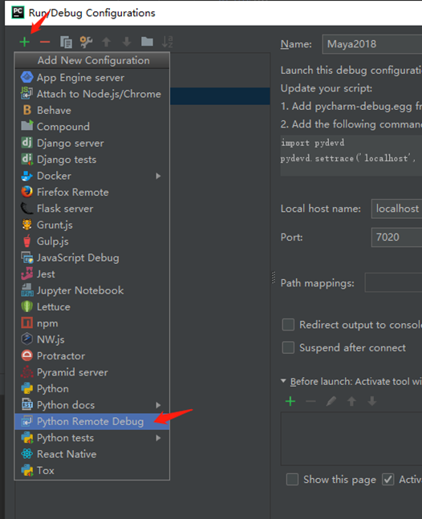

填入Debug配置的名称，按以下标识勾选就可以了，端口Port 任意一个就可以了，只要还未被其他进程使用的端口都可以 
配置好之后 点击 Apply 应用就可以了

&emsp;

### 2. 在Pycharm开启Debug远程
&emsp;

事先准备好测试的脚本即可
确认好Debug配置文件是远程Debug配置，然后点击甲虫标志的按钮，或者Run -> Debug
或者按debug的快捷键

&emsp;

进入到等待连接Maya的状态
&emsp;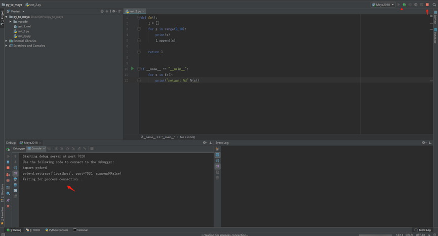

### 3. 运行连接代码

&emsp;打开任意版本的maya，在python窗口执行以下的脚本

```python
import sys
# This should be the path your PyCharm installation
pydevd_egg = r"C:\Program Files\JetBrains\PyCharm 2018.1.4\debug-eggs\pycharm-debug.egg"
if not pydevd_egg in sys.path:
   sys.path.append(pydevd_egg)

import pydevd
pydevd.settrace('localhost', port=7020, suspend=False)
```
&emsp;

egg 路径是 pycharm安装的路径 可以检查一下本地安装的pycharm的安装路径下有debug-eggs文件夹

连接窗口的命令的在配置的时候，就有 直接复制即可
&emsp;

Pycharm连接到了maya的状态，以下就是连接成功的状态
&emsp;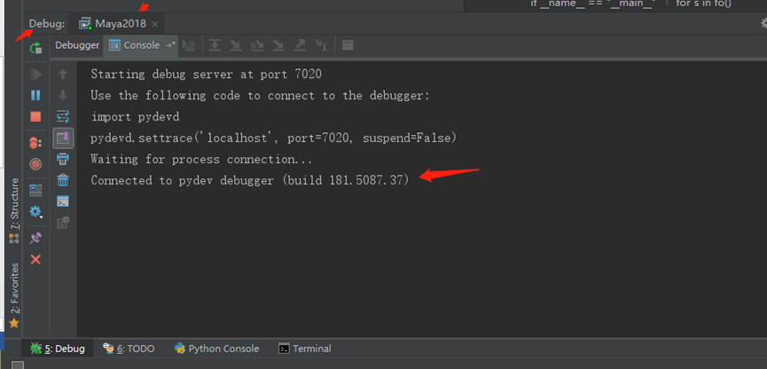

进行脚本的调试
&emsp;在Pycharm进行断点
&emsp;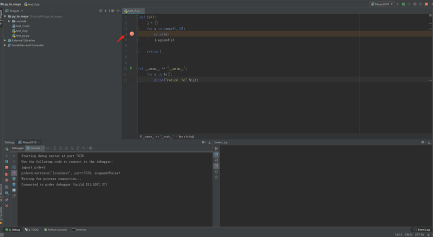

&emsp;在maya内运行测试脚本的启动命令，这时Pycharm就进入了调试的状态，可以运用Pycharm的debug按钮进行代码的调试，这时Maya进入假死的状态（无法点击Maya窗口任何按钮），在pycharm调试的结果也会实时把信息打印在maya的脚本窗口
&emsp;

Maya执行启动脚本的命令 根据测试的脚本 重新编写
&emsp;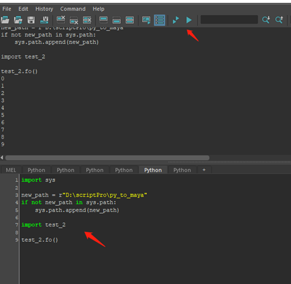

存在一个bug，Pycharm如果中断了连接状态，要重新连接maya，maya需要重启再运行脚本才可以重新连接上
&emsp;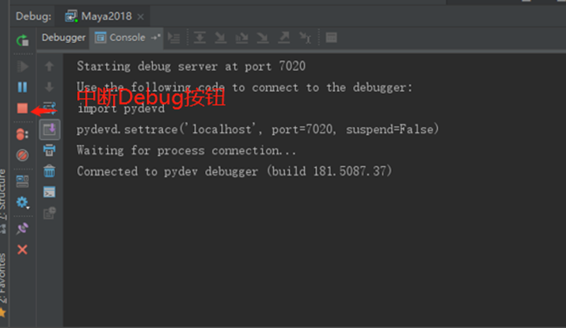

## VS code篇

参考网址：
- [VScode - MayaPy插件开发总结](https://blog.l0v0.com/posts/4d164b82.html)

- [Debugging Maya using Visual Studio Code](http://iwonderwhatjoeisworkingon.blogspot.com/2017/04/debugging-maya-using-visual-studio-code.html)

vsc有作者 智伤帝 写的vsc插件也可以实现 具体操作可以看插件说明
以下是手动连接

### 1. 下载 ptvsd 库
&emsp; 测试过以下版本是可以的
&emsp; https://github.com/microsoft/ptvsd/releases/tag/v4.3.2
&emsp; 解压提取src的ptvsd库，复制到maya的scripts路径下

&emsp;

&emsp;

### 2. 配置vsc的Debug文件

&emsp;在准备好的测试项目下，点击Run and Debug，弹出的选择配置Remote Attach，全部按默认的按回车键（Enter键），最后打开json文件（不出来可以按上面操作几次），这时就有了项目配置的json文件了
&emsp;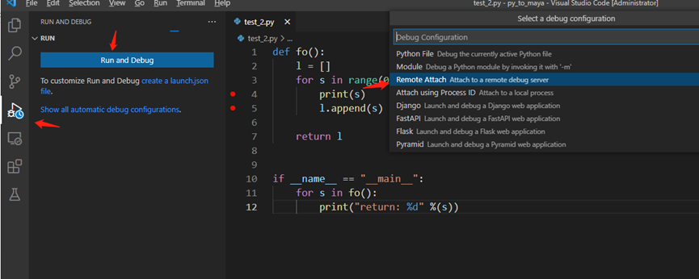

&emsp;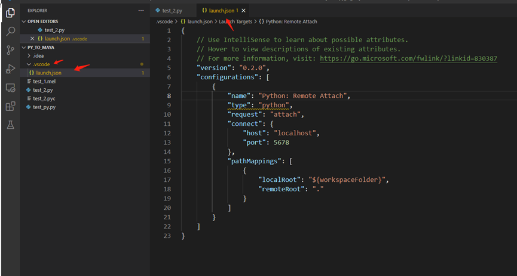

修改端口和其他 按下面修改即可 记得保存json文件

&emsp;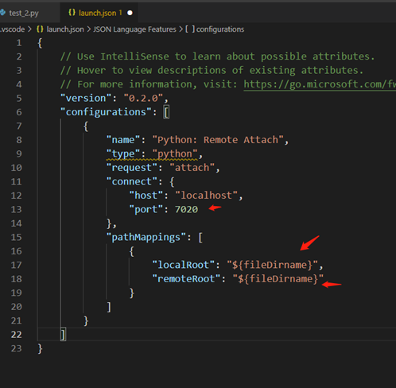

### 3. 运行连接代码
&emsp; 在maya打开端口，运行代码窗口会闪一下

```python
import ptvsd
# 默认情况开启 localhost:5678 端口
#ptvsd.enable_attach()
# 可以传入元组来定义 地址和端口号
ptvsd.enable_attach(('localhost',7020))
```

脚本的端口改为和json设置的端口就可以了 在maya的python窗口运行
&emsp;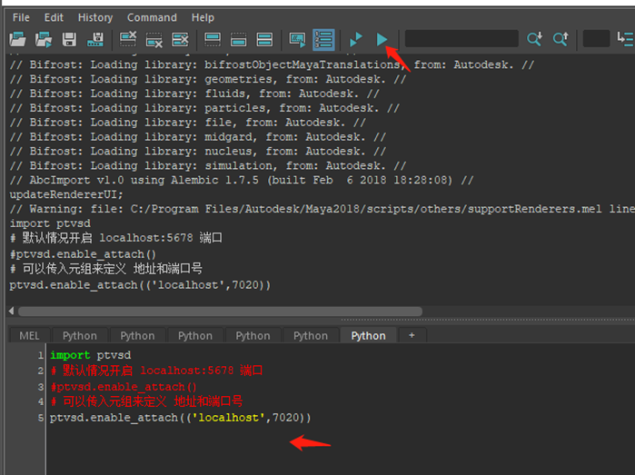

### 4. 在vsc进入连接maya的Debug调试状态
&emsp;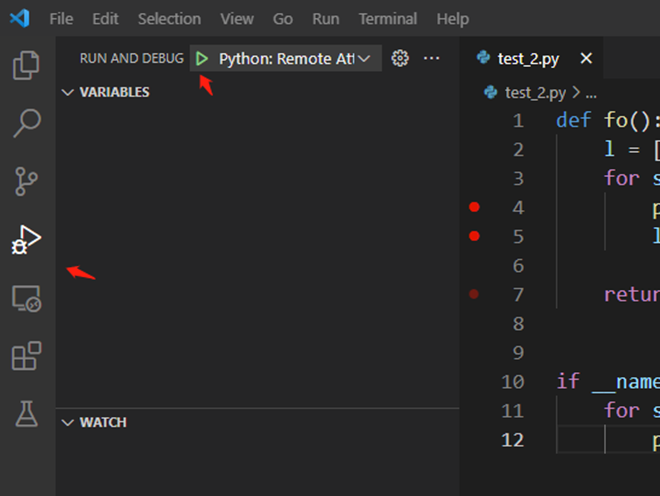

进入Debug调试状态
&emsp;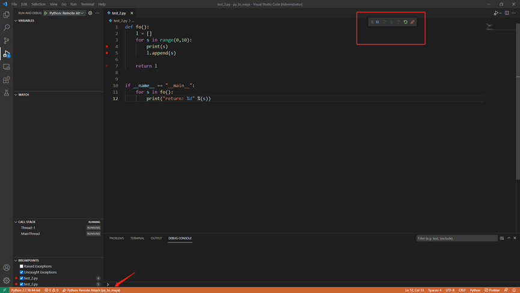

进入Debug状态之后，在vsc进行断点

&emsp;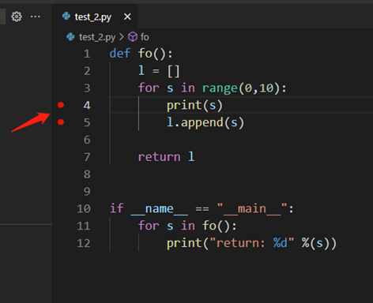

&emsp;然后可以在maya运行测试脚本的启动命令，这是就进入到了Maya的Debug脚本调试了，和Pycharm一样的情况，vsc的优点就是断开连接之后不用重启maya再连接
&emsp;