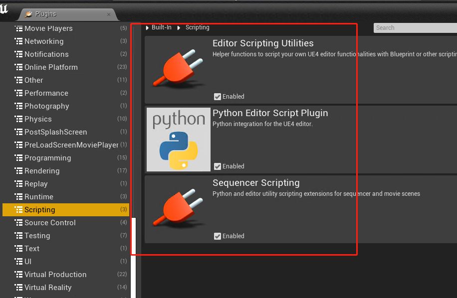
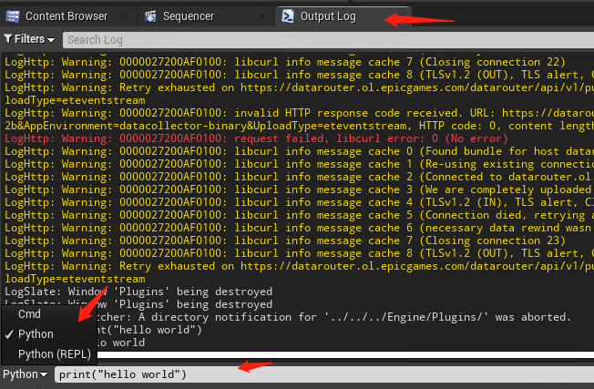
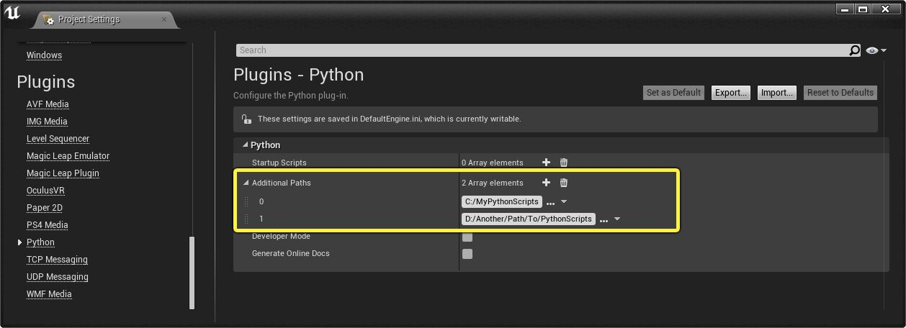
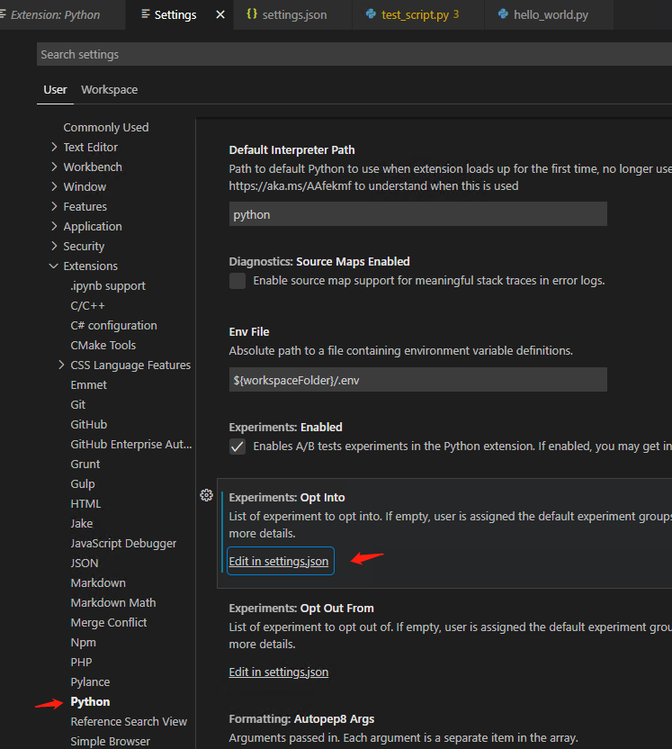
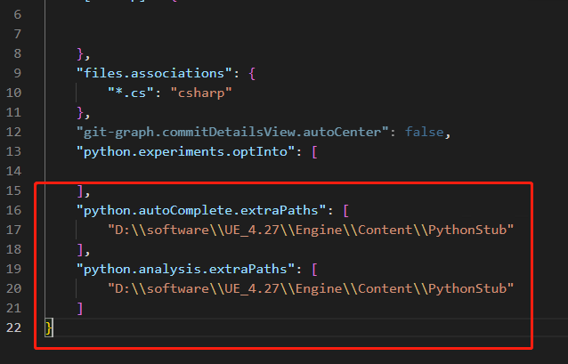
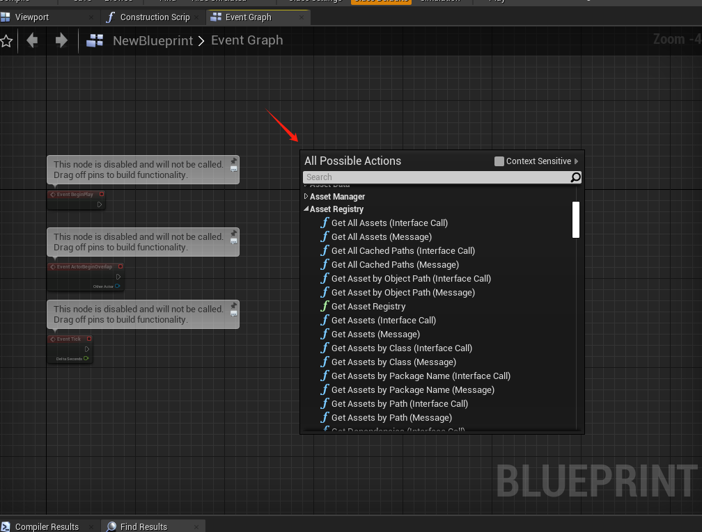
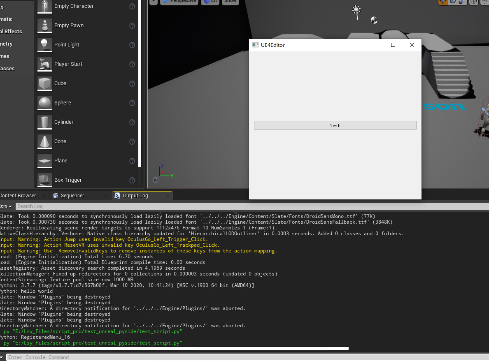

# Unreal使用Python

&emsp; **参考文章**

&emsp; [使用Python脚本化运行编辑器](https://docs.unrealengine.com/4.27/zh-CN/ProductionPipelines/ScriptingAndAutomation/Python/)

## 1. Unreal使用Python

### 1.1 开启python插件

&emsp; 在插件控制器，开启python相关插件，重启即可



&emsp; 在outputLog的python窗口可以输入python的代码，或者cmd窗口执行py文件



### 1.2 使用init_unreal.py 文件

init_unreal.py 文件的使用类似于Maya的userSetup.py文件，把init_unreal.py 文件放在指定的路径下，然后Unreal编辑器启动的时，就会自动执行该py文件

Unreal的**init_unreal.py文件默认python路径**

- 项目文件夹下的 Content/Python 子文件夹。
- 主虚幻引擎安装文件夹中的 Content/Python 子文件夹。
- 每个启用的插件的文件夹下的 Content/Python 子文件夹。
- 用户目录中的 Documents/UnrealEngine/Python 文件夹。例如，在Windows 10中，该路径是`C:/Users/Username/Documents/UnrealEngine/Python`
- 在系统环境变量中PYTHONPATH指定的路径

在Unreal添加python路径



### 1.3 配置vscode

生成py开发配置的unreal.py文件，把PythonStub拷贝到UE安装目录下的Content/PythonStub


在VSCode的python的setting文件设置相关路径，重启vsc即可使用智能提示





### 1.4 查找Unreal函数技巧

重点：在Unreal中能<font color=red>使用Python的函数都是蓝图命令</font>; 在任意蓝图节点的事件图表可以查看到



同样的可以在Unreal的<font color=red> C+中扩展Python的函数(实质上就是编写蓝图节点)</font>

示例：

```c++
// TestScriptLibrary.h
// Copyright Epic Games, Inc. All Rights Reserved.

#pragma once

#include "Kismet/BlueprintFunctionLibrary.h"
#include "TestScriptingLibrary.generated.h"


UCLASS()
class UTestScriptingLibrary : public UBlueprintFunctionLibrary
{
        GENERATED_UCLASS_BODY()
        
        // 使用UFUNCTION指定函数，并使用BlueprintCallable标记函数是蓝图的节点
        UFUNCTION(BlueprintCallable, Category = "TestScriptingLibrary")
        static TArray<FString> GetSelectedPathViewFolders();

        UFUNCTION(BlueprintCallable, Category = "TestScriptingLibrary")
        static TArray<UObject*> GetReferencedAssetsForSelectedActor(const bool bIgnoreOtherAssetsIfBPReferenced);

        UFUNCTION(BlueprintCallable, Category = "TestScriptingLibrary")
        static void SetSelectedPaths(const TArray<FString>& FolderPaths, bool bNeedsRefresh = false);

        UFUNCTION(BlueprintCallable, Category = "TestScriptingLibrary")
        static int32 GetNumberUVChannels(UStaticMesh* StaticMesh, int32 LODIndex);

        UFUNCTION(BlueprintPure, Category = "TestScriptingLibrary")
        static int32 GetNumBones(USkeletalMesh* SkeletalMesh);

        UFUNCTION(BlueprintCallable, Category = "TestScriptingLibrary")
        static TArray<FString> GetAllProperties(UClass* Class);

        UFUNCTION(BlueprintCallable, Category = "TestScriptingLibrary")
        static UPackage* GetPackage(const FAssetData& AssetData);

        UFUNCTION(BlueprintCallable, Category = "TestScriptingLibrary")
        static void PrintAssetData(const FAssetData& AssetData);

        UFUNCTION(BlueprintCallable, Category = "TestScriptingLibrary")
        static void CollectUnreferenceAsset();

};
```

## 2. Unreal使用PySide2

PySide2安装到Unreal的Python下，可以直接用Python的Pip安装，或者使用sys.path.append把PySide2的库添加到Unreal的python路径



在cmd执行以下py文件即可

```python
import sys

# sys.path.append(".../pyside2_libs") # 添加PySide2的库到Unreal的Python路径
#

from PySide2 import QtGui
from PySide2 import QtWidgets

import unreal

class TestWidget(QtWidgets.QWidget):
        def __init__(self, parent=None):
                super(TestWidget, self).__init__(parent)

                vbox = QtWidgets.QVBoxLayout(self)
                btn = QtWidgets.QPushButton('Test')
                btn.clicked.connect(self.btn_clicked)
                vbox.addWidget(btn)

        def btn_clicked(self):
                print('Clicked')
                unreal.log('Clicked')


app = None
if not QtWidgets.QApplication.instance():
        app = QtWidgets.QApplication(sys.argv)        

widget = TestWidget()
widget.show()

# 把PySide的窗口指针绑到Unreal的窗口 
unreal.parent_external_window_to_slate(widget.winId())
```