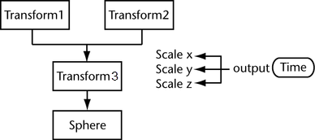
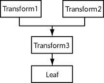

# 001-Maya API 概念整理
## 1. DG、DAG概念整理
  - DG：Dependency Graph  依赖图可循环，简单理解DG表示连接关系
    

  - DAG：directed acyclic graph  有向无循环图，简单理解DAG表示父子（或层级）关系
    

**首先需要明确的是，DG/DAG 与 DG/DAG节点  是两个概念。DG/DAG是graph（图形），准确的说是对于节点结构的表现方式，DG/DAG节点则是节点。
DG和DAG的概念就是描述Maya的节点关系，DG是连接关系，DAG是父子关系；基本上可以认为maya当中所有的node都是DG节点，包括DAG节点**
## 2. DG/DAG
  Windows -> GeneralEditors 可以打开Hypergraph
  其中hierarchy是以DAG的结构展现的 connections（连接）是以DG的结构展现的 
  

  进入其中任意一个，点击图标也可以切换
  

- DAG/Hypergraph hierarchy/directed acyclic graph
在DAG模式中，场景中的所有DAG节点（关于DAG节点会稍后解释）都会全部以层级的方式显示出来


- DG/Hypergraph connections/Dependency Graph
DG模式中，只有当前选中的DG节点且与之存在connection关系的节点会被显示出来


- Hierarchy（层级）/connection（连接）
Hierarchy与connection（directed acyclic graph/Dependency Graph）区别在于direction（方向）和cyclic（循环），也就是两个node之间数据传输的方向和是否会是产生循环
hierarchy是很简单的父子结构，单纯的单向数据传输（继承）关系，用于tranform；connnection则复杂且自由的多
需要注意的是，hierarchy的关系在connection并没有被表现出来（没有线连接）
所以connnection只展现了hierarchy以外iade关系。Hierarchy关系需要进入hierarchy graph
## 3. DG/DAG节点
- DG节点：基本上可以认为maya当中所有的node都是DG节点，包括DAG节点
DAG节点：只有两种DAG node，transform 和shape；shape永远是transform的child；一组transform+shape组成一组DAG 结构
官方对于DAG的描述：
从本质上说，DAG是instance（实例）从几何体中构造出来的过程的分解
In essence, the DAG is a breakdown of how an instance of an object is constructed from a piece of geometry

- 理解一下这个创造过程
  1. cube来自cmds.polyCube create
  2. create之后产生了一个polyCube的instance ：polyCube6
  3. 由polyCube6产生了shape：pCubeShape6
  4. pCube6则是shape的transform

  

- Outliner当中 的相关显示选项；Outliner当中默认是只显示DAG而不显示其他的DG，并且不显示shapes的；需要的时候可以打开

  

补充:
- maya里面object是由tranform+shape 组成的
sphere0=cmds.polySphere()[0]
cmds.polyShpere 所return的不是object name的string，而是一个list，
list里面有2个string，一个是transform name，一个是shape name

  ```python
  import maya.cmds as cmds
  sphere=cmds.polySphere() #获得包含2个tring的list
  print(sphere)

  sphere0=cmds.polySphere()[0]#获得return的list当中的第一个string
  print(sphere0)
  sphere1=cmds.polySphere()[1]]#获得return的list当中的第二个string
  print(sphere1)
  ```

  

## 参考

- [Maya 数据结构:DG /DAG/Shape/Transform概念整理](https://zhuanlan.zhihu.com/p/360546258)
- [DAG 层次结构概述](https://help.autodesk.com/view/MAYAUL/2018/CHS/?guid=__files_DAG_Hierarchy_Overview_of_the_DAG_Hierarchy_htm)
- [节点](https://help.autodesk.com/view/MAYAUL/2018/CHS/?guid=__files_DAG_Hierarchy_Nodes_htm)
- [变换和形状](https://help.autodesk.com/view/MAYAUL/2018/CHS/?guid=__files_DAG_Hierarchy_Transforms_and_shapes_htm)
- [有向无环图路径](https://help.autodesk.com/view/MAYAUL/2018/CHS/?guid=__files_DAG_Hierarchy_DAG_paths_htm)